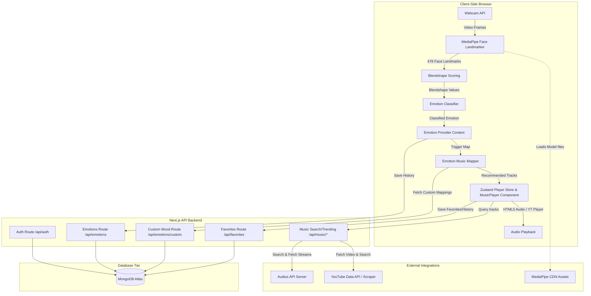
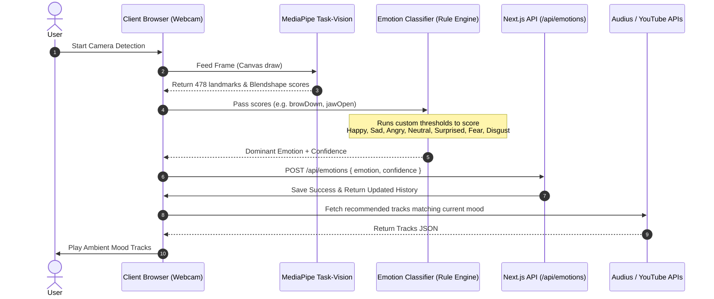
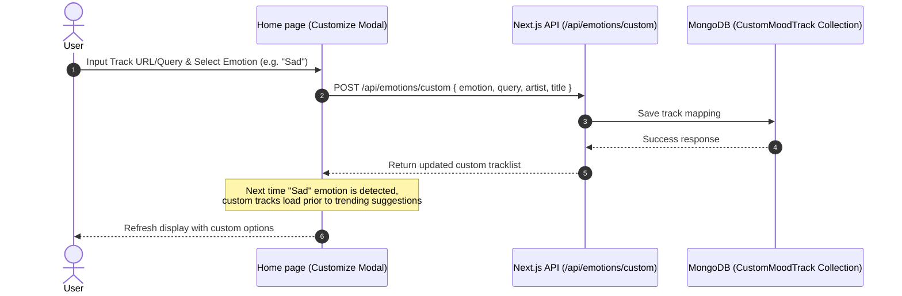

# FaceTune 🎵

[](https://nextjs.org/)
[](https://react.dev/)
[](https://tailwindcss.com/)
[](https://www.mongodb.com/)
[](https://authjs.dev/)
[](https://ai.google.dev/edge/mediapipe/solutions/guide)

FaceTune is a premium, highly interactive, AI-powered music streaming application. It captures real-time facial expressions through the webcam, extracts face mesh blendshapes, classifies the dominant user emotion into one of seven categories, and custom-recommends a tailored playlist. 

Designed with a breathtaking **glassmorphic aurora gradient** (ocean-cyan to electric-blue to hot-pink), FaceTune provides micro-interactions, smooth ambient glow transitions, custom song mappings, detailed history analytics, and secure authorization services.

---

## 🌟 Core Features

- **Real-Time Webcam Facial Expression Tracking**: Powered by Google **MediaPipe Tasks Vision** (self-hosted model) running fully client-side. Maps 478 3D landmark points and processes blendshape categories to detect expression intensities.
- **Rule-Based Emotion Classifier**: Custom heuristics mapping blendshapes to **7 primary emotions**: *Happy, Sad, Angry, Surprised, Fearful, Disgusted, and Neutral*.
- **Personalized Music Recommendation Engine**: Dynamically queries tracks based on the current emotion using the decentralized **Audius API Network** and fallback **YouTube Data API v3** search integration.
- **Custom Emotion-Music Mappings**: Empower users to bind specific search queries or custom tracks directly to their emotions, overriding default suggestions.
- **Interactive Music Player**: A fixed, smooth glassmorphic media player handling queue creation, shuffling, repeating, drag-and-drop tracks, dynamic volume scaling, and a fullscreen animated ambient visualizer.
- **User Analytics & Mood History**: Fully responsive dashboard visualizer containing Mongoose-backed history tracking, featuring charts (recharts) for mood distribution, daily mood changes, and listening trends.
- **Secure Authentication**: Built using **Auth.js (NextAuth v5)** supporting Credentials login/registration (with bcryptjs password hashing) and OAuth integrations (Google, GitHub).

---

## 🌐 System Architecture

FaceTune follows a clean three-tier web application architecture: Client, Next.js API Backend, and Database & External Services.

### High-Level Architectural Flow



---

### Sequence Diagrams

#### 1. Real-Time Emotion Classification & Music Recommendations

This process operates on an interval to analyze the user's face, determine the dominant emotion, record the state history, and request corresponding music:



#### 2. Managing Custom Songs for Emotions

Users can customize recommended playlists by binding search queries or tracks directly to specific emotions:



---

## 🛠️ Technology Stack

- **Framework**: [Next.js v16.2.7](https://nextjs.org/) (App Router, Turbopack enabled)
- **Library**: [React v19.2.7](https://react.dev/)
- **Styling**: [Tailwind CSS v4.3.0](https://tailwindcss.com/) with PostCSS
- **Animations**: [Framer Motion v12.4.0](https://www.framer.com/motion/) for fluid transitions, dynamic scaling, and interactive dragging
- **Database**: [MongoDB Atlas](https://www.mongodb.com/) via [Mongoose v9.6.3](https://mongoosejs.com/) Object-Document Mapper
- **State Management**: [Zustand v5.0.14](https://github.com/pmndrs/zustand) for centralized audio player state
- **Authentication**: [Auth.js v5](https://authjs.dev/) (Credentials, GitHub, Google Providers)
- **Face Mesh API**: Google [@mediapipe/tasks-vision v0.10.35](https://www.npmjs.com/package/@mediapipe/tasks-vision)
- **Charts**: [Recharts v3.8.1](https://recharts.org/) (Responsive mood analytics, historical charts)
- **Notifications**: [Sonner v2.0.7](https://emilkowal.se/ui/sonner) for stylish notifications

---

## 📁 Repository Structure

```
FaceTune/
├── public/
│   └── models/
│       └── face_landmarker.task  # MediaPipe Vision model file (3.7MB)
├── src/
│   ├── app/
│   │   ├── (auth)/               # Auth Pages (Login, Sign-Up)
│   │   ├── (dashboard)/          # Application Main Sub-pages
│   │   │   ├── analytics/        # Charts & Statistics View
│   │   │   ├── discover/         # Track Searching & Genre Browsing
│   │   │   ├── favorites/        # Saved/Liked Track Playlists
│   │   │   ├── home/             # Main Detection Dashboard
│   │   │   ├── mood-history/     # Daily mood tracker history logs
│   │   │   └── recommendations/  # Advanced suggestions page
│   │   ├── api/                  # API Route Handlers
│   │   │   ├── auth/             # [...nextauth] Auth configurations
│   │   │   ├── emotions/         # Emotion history and Custom Mappings API
│   │   │   ├── favorites/        # Personal favorite tracks CRUD
│   │   │   └── music/            # Search & Trending handlers for Audius/YT
│   │   ├── globals.css           # Tailwind custom rules & premium design styles
│   │   ├── layout.tsx            # Global layout wrapper
│   │   └── page.tsx              # Front Landing/Hero Page
│   ├── components/
│   │   ├── layout/               # Header and Sidebar navigation components
│   │   └── music/                # Premium MusicPlayer container
│   ├── hooks/
│   │   └── useEmotionDetection.ts # Custom React hook loading MediaPipe
│   ├── lib/
│   │   ├── audius.ts             # Audius API integration layer
│   │   ├── auth.ts               # Auth.js configurations and helpers
│   │   ├── emotion-detector.ts   # Rule-based blendshape classifier
│   │   ├── emotion-music-mapper.ts# Default mappings between emotions and queries
│   │   ├── mongodb.ts            # Mongoose client initialization
│   │   └── youtube.ts            # YouTube Scraper and Data API integration
│   ├── models/
│   │   ├── CustomMoodTrack.ts    # Model mapping emotion to target tracks
│   │   ├── EmotionHistory.ts     # Log model recording emotion entries
│   │   ├── Favorite.ts           # Log model tracking liked tracks
│   │   ├── ListeningHistory.ts   # History entries tracking played items
│   │   └── User.ts               # Authenticated credentials user
│   ├── providers/                # React Context Providers (Emotion, Music)
│   ├── stores/                   # Zustand store files (playerStore.ts)
│   └── types/                    # TypeScript interfaces & types
├── .env.example                  # Environment Variables Template
├── .gitignore                    # Git files exclusion configuration
├── next.config.ts                # Next.js bundler settings
├── postcss.config.mjs            # PostCSS plugin settings
├── tailwind.config.ts            # Tailwind CSS configurations
└── tsconfig.json                 # TypeScript build specifications
```

---

## 🗄️ Database Models Schema

FaceTune stores user metadata, history, and preferences using structured Mongoose schemas:

### 1. User
- `name` (String): Full name of the user.
- `email` (String, Unique): E-mail address used for credentials/OAuth identification.
- `password` (String, Optional): Bcrypt hashed password (null for OAuth users).
- `image` (String, Optional): Profile image avatar URL.

### 2. EmotionHistory
- `userId` (ObjectId, Reference: User): Owning user identifier.
- `emotion` (String): Dominant classification value (`happy`, `sad`, `angry`, `neutral`, `surprised`, `fearful`, `disgusted`).
- `confidence` (Number): Accuracy percentage score from 0.0 to 1.0.
- `timestamp` (Date): DateTime entry point.

### 3. CustomMoodTrack
- `userId` (ObjectId, Reference: User): Owning user identifier.
- `emotion` (String): Targets emotion key to map.
- `title` (String): Music track name.
- `artist` (String): Author name.
- `query` (String): Search string identifier.
- `provider` (String): Audio service provider (`audius` | `youtube`).
- `trackId` (String): Unique stream identity.
- `duration` (Number, Optional): Play length in seconds.

### 4. Favorite
- `userId` (ObjectId, Reference: User): Owning user identifier.
- `trackId` (String): Direct API target track ID.
- `title` (String): Saved track header.
- `artist` (String): Saved track author.
- `provider` (String): Playback system (`audius` | `youtube`).
- `duration` (Number, Optional): Total duration.
- `imageUrl` (String, Optional): Thumbnail link.
- `streamUrl` (String, Optional): Dynamic music stream stream link.

---

## 🚀 Local Installation & Setup

Follow these instructions to run the application on your computer:

### Prerequisites
- [Node.js](https://nodejs.org/) v20 or later
- [npm](https://www.npmjs.com/) v10 or later
- [MongoDB Atlas](https://www.mongodb.com/cloud/atlas) or a running local MongoDB instance.

### 1. Clone the Repository
```bash
git clone https://github.com/Prudhvi2206/FaceTune.git
cd FaceTune
```

### 2. Install Dependencies
```bash
npm install
```

### 3. Configure Environment Variables
Copy `.env.example` to create `.env.local` inside the root folder:
```bash
cp .env.example .env.local
```
Edit `.env.local` with your database credentials and OAuth credentials:
```properties
# MongoDB Connections
MONGODB_URI=mongodb+srv://<username>:<password>@cluster.mongodb.net/facetune?retryWrites=true&w=majority

# NextAuth v5 Configurations
AUTH_SECRET=any_32_character_hex_or_string
NEXTAUTH_URL=http://localhost:3000

# OAuth Integrations (Optional)
AUTH_GOOGLE_ID=
AUTH_GOOGLE_SECRET=
AUTH_GITHUB_ID=
AUTH_GITHUB_SECRET=

# External API Integrations (Optional)
AUDIUS_API_KEY=
YOUTUBE_API_KEY=
```

### 4. Run the Development Server
```bash
npm run dev
```
Open [http://localhost:3000](http://localhost:3000) inside your web browser to access FaceTune!

### 5. Production Build
To create an optimized production build of the project:
```bash
npm run build
npm run start
```

---

## 🔒 Security Notice

FaceTune ensures all user passwords are encrypted using `bcryptjs` and session tokens are signed using JWT. The project's configuration ignores `.env.local` and `.env` through `.gitignore` to prevent database keys, credentials, or client secrets from being exposed inside public commits. Do not commit actual credential strings.
