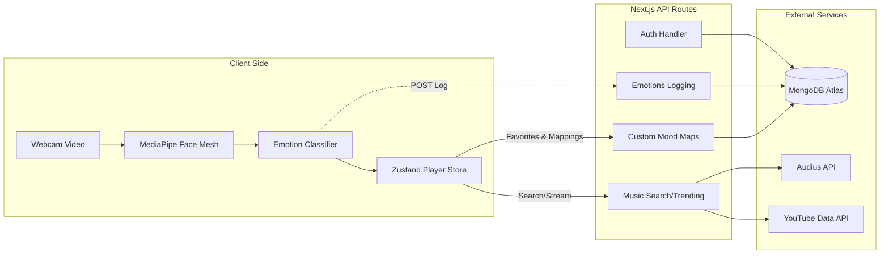

# FaceTune 🎵

[](https://nextjs.org/)
[](https://react.dev/)
[](https://tailwindcss.com/)
[](https://www.mongodb.com/)
[](https://authjs.dev/)

FaceTune is an interactive, AI-powered music companion that captures real-time facial expressions through your webcam, detects your dominant emotion, and recommends customized soundtracks matching your mood. Designed with a premium dark glassmorphic UI, it supports custom mood song bindings, listening analytics, and secure authorization.

---

## 🌟 Core Features

- **Real-Time Emotion Tracking**: Powered by client-side Google **MediaPipe Tasks Vision** detecting 7 primary emotions (*Happy, Sad, Angry, Surprised, Fearful, Disgusted, and Neutral*).
- **Smart Music Recommender**: Queries matching playlists dynamically from the decentralized **Audius API Network** and fallback **YouTube Data API**.
- **Custom Song Mapping**: Empower users to search and assign specific songs to any emotion, overriding the defaults.
- **Fixed Music Player**: Frosted glass music bar supporting playback queues, dynamic volume scaling, repeat/shuffle, and fullscreen ambient visualizers.
- **Mood Analytics**: Visual charts mapping user mood logs and listening history trends over time.
- **Secure Authentication**: Credentials and OAuth login options powered securely by **Auth.js (NextAuth v5)**.

---

## 🌐 System Architecture

FaceTune runs on a classic client-server model:



---

## 🚀 Quick Start

### 1. Install Dependencies
```bash
npm install
```

### 2. Configure Environment Variables
Copy `.env.example` to `.env.local` and add your database/OAuth secret configurations:
```properties
MONGODB_URI=mongodb+srv://<username>:<password>@cluster.mongodb.net/facetune
AUTH_SECRET=your_nextauth_auth_secret_string
NEXTAUTH_URL=http://localhost:3000
```

### 3. Run Development Server
```bash
npm run dev
```
Open [http://localhost:3000](http://localhost:3000) inside your web browser.

### 4. Build for Production
```bash
npm run build
npm run start
```
